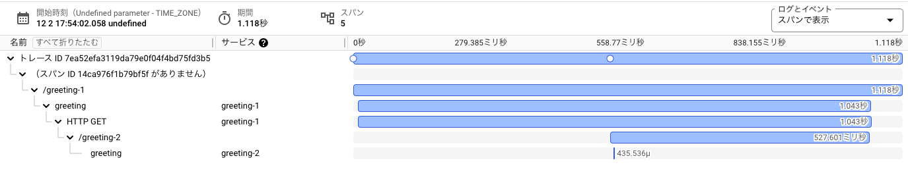
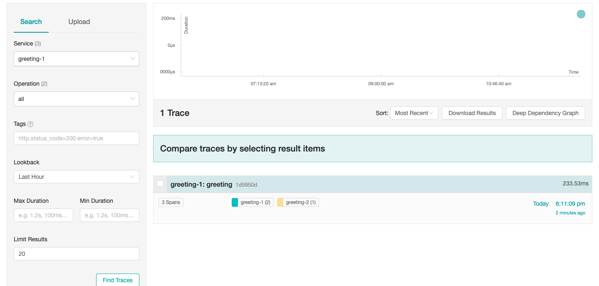

# OpenTelemetry Go Cloud Functions Example
This is an example of OpenTelemetry Go Cloud Functions.

# Prerequisites
- Docker
- Create a project on Google Cloud Platform

# Deploy
## Deploy OpenTelemetry Collector

```bash
cd otel-collector
# Set your project id
vi deploy.sh 
./deploy.sh
```

Save URL of the deployed OpenTelemetry Collector.

## Deploy Cloud Functions

```bash
cd greeting
# Set your project id and OpenTelemetry Collector URL
vi env-greeting-1.yaml
vi env-greeting-2.yaml
./deploy.sh
```

## Check Trace
- curl to greeting-1

For example,

```bash
curl https://asia-northeast1-instruments-cloud-function.cloudfunctions.net/greeting-1
```

- check trace by Cloud Trace UI
    - Access https://console.cloud.google.com/traces/traces



# Local Development
## termianl1 - start jager all-in-one

```bash
docker compose up
```

## termianl2 - start cloud function

```bash
cd greeting
export OTEL_SERVICE_NAME=greeting-1
export PORT=8080
export NEXT_ENDPOINT=http://localhost:8081
FUNCTION_TARGET=Greeting LOCAL_ONLY=true go run cmd/main.go
```

## termianl3 - start cloud function

```bash
cd greeting
export OTEL_SERVICE_NAME=greeting-2
export PORT=8081
FUNCTION_TARGET=Greeting LOCAL_ONLY=true go run cmd/main.go
```

## termianl4 - curl to greeting-1

```bash
curl http://localhost:8080
```

output is
```
Hiya!
```

## check trace by jaeger UI

- Access http://localhost:16686/search

